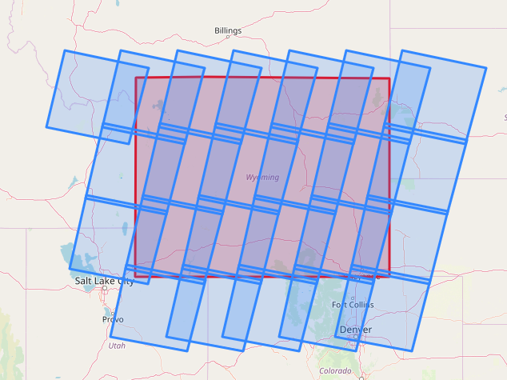

## K Perham

Here's some stuff I've worked on in the past.

### Post-fire imagery selection and download script

A simple way to download imagery based on the date of last fire that occured in a LandSat scene.

[Post-fire L8 imagery - Jupyter Notebook](Download_L8Imagery_Post_Fire.ipynb)  

### Examining the distribution of bedrock types using USGS data

## UC Boulder - open coursework for the graduate certificate in Earth Data Science https://www.earthdatascience.org/

### Here's a few of the projects I first learned to code in R

[Cloud Mask](https://github.com/kmp24/CloudMask/blob/master/README.md) 

## University of Helsinki

